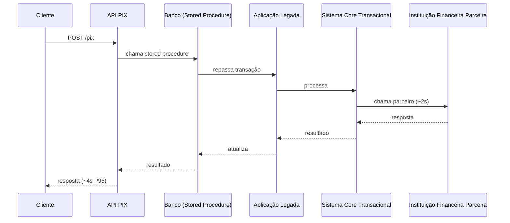
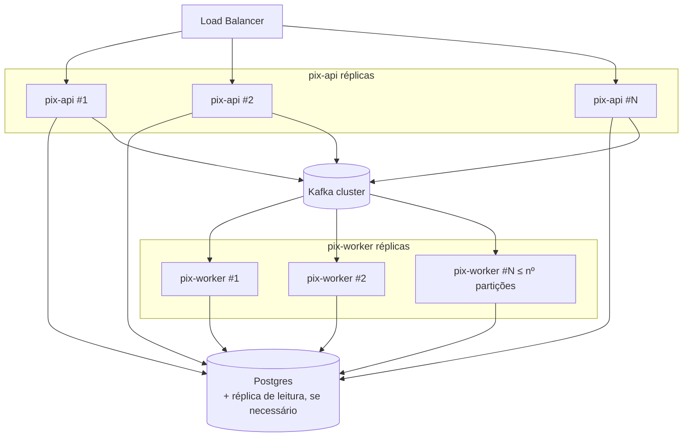

# Arquitetura

## Estado atual (baseline do enunciado)



Cada seta é síncrona e bloqueante: o cliente fica preso ao pior caso de latência de toda a cadeia, incluindo os ~2s do parceiro, que por premissa do enunciado não podem mudar.

## Arquitetura proposta

```mermaid
flowchart LR
    subgraph Client[ ]
        C[Cliente]
    end

    subgraph API_Tier[Camada API - stateless, escala horizontal]
        API[PixController]
        ING[PixIngestionService]
    end

    subgraph DB[(PostgreSQL)]
        TX[(pix_transaction)]
        OUT[(outbox_event)]
    end

    subgraph Relay[Outbox Relay]
        REL[OutboxRelay<br/>polling + SKIP LOCKED]
    end

    subgraph Kafka[Kafka]
        T1[[pix.requested<br/>12 partições, key=transactionId]]
        T2[[pix.requested.dlt]]
        T3[[pix.processed]]
    end

    subgraph Worker_Tier[Camada Worker - escala independente]
        CONS[PixEventConsumer]
        PROC[PixProcessingService]
        RES[ResilientPartnerCaller<br/>Retry + CircuitBreaker + Timeout]
        NOTIF[NotificationConsumer<br/>stub de extensão futura]
    end

    subgraph Partner[Instituição Financeira Parceira]
        PFI[~2s de latência, falhas transitórias<br/>não pode ser alterada]
    end

    C -->|POST /pix| API
    API --> ING
    ING -->|1 transação DB: insere transação + evento outbox| TX
    ING --> OUT
    API -->|202 Accepted, status=RECEIVED| C

    REL -->|claim batch| OUT
    REL -->|publica| T1

    T1 --> CONS
    CONS --> PROC
    PROC -->|idempotente: já terminal?| TX
    PROC --> RES
    RES --> PFI
    PFI -->|confirma / rejeita / falha transitória| RES
    RES --> PROC
    PROC -->|CONFIRMED / FAILED| TX
    PROC --> T3
    T3 --> NOTIF

    RES -.->|retries esgotados: backoff do container| T2
    T2 -.->|reconciliação manual| Ops[(Time de operações)]

    C -->|GET /pix/id| API
    API --> TX
```

Pontos-chave:

- **A resposta ao cliente não depende mais do parceiro.** `POST /pix` só espera uma transação local no Postgres (inserir a transação + o evento de outbox) — por isso o P95 cai de ~4s para a ordem de dezenas de milissegundos.
- **Kafka particionado por `transactionId`** preserva ordenação por transação e permite escalar o número de workers independentemente da API.
- **Outbox transacional** elimina a janela de inconsistência entre "commitei no banco" e "publiquei no Kafka".
- **Duas camadas de resiliência**: Resilience4j (retry + circuit breaker + timeout) cobre falhas de milissegundos/segundos dentro de uma entrega; o backoff do container Kafka cobre falhas sustentadas ao longo de várias entregas; o DLT é o último recurso, com a transação marcada `FAILED_RETRYABLE` para reconciliação manual.
- **GET /pix/{id}** é uma leitura simples e indexada no Postgres — não depende de Kafka nem do parceiro.

## Diagrama de implantação (visão de escala)



A API e o worker são o mesmo artefato Spring Boot, diferenciados pelo profile ativo (`api`, `worker` ou `all` para desenvolvimento local) — ver `docker-compose.yml`.
